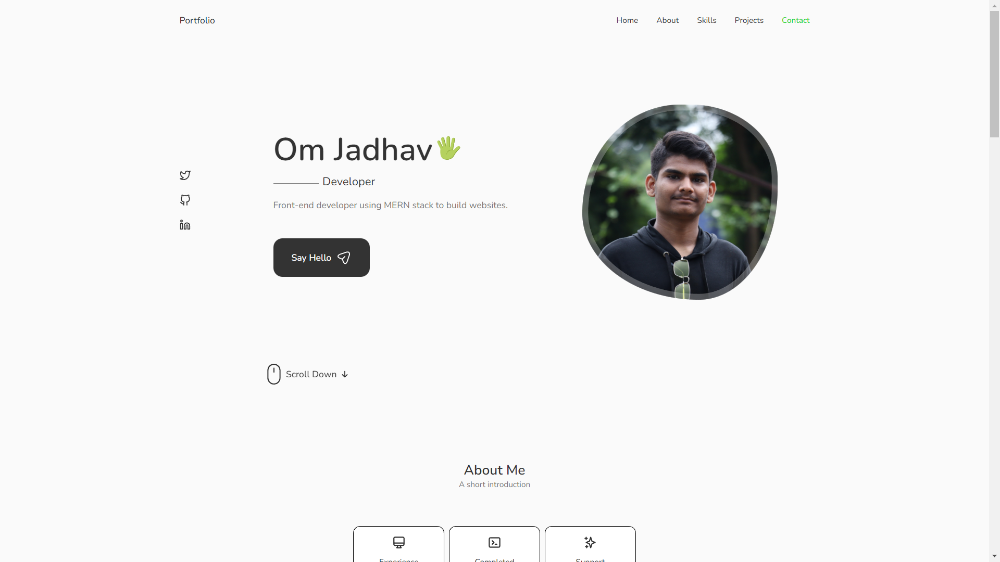
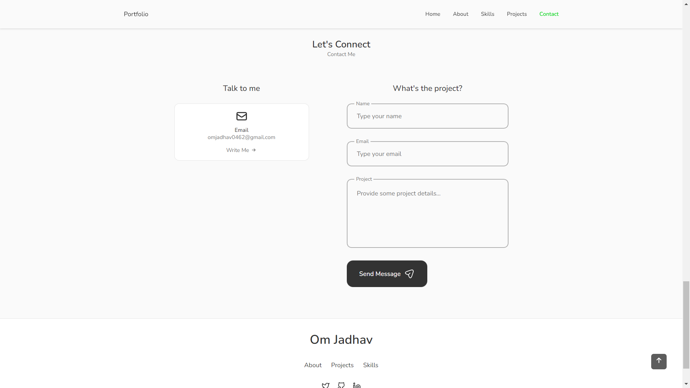

# Portfolio Project

This is a responsive portfolio site created with ReactJS and plain CSS that implements Swiper for sliding components and EmailJS for contact services.

### Project Features:

- Responsive Layout
- Fixed Navigation
- Pop-up Modals
- Tab Panels
- Contact Form
- Scroll to Top

## React-Icons

`npm install react-icons --save`

The icons from this project can be found in the _Feather_ or _Heroicon_ sections of the [React-Icons](https://react-icons.github.io/react-icons/) library.

## Email Component

`npm install @emailjs/browser --save`

The form modal of the contact section is setup using SDK and an email template from [EmailJS](https://www.emailjs.com/docs/examples/reactjs/).

## Authors

- [@omjadhav1](https://github.com/OmJadhav1/)

## 🔗 Links

## Credit

This project was built following a tutorial by Cryptical Coder. It can be found [here](https://www.youtube.com/watch?v=3aCoZudPEKE&t=143s&ab_channel=CrypticalCoder) if you'd like to give it a try.
